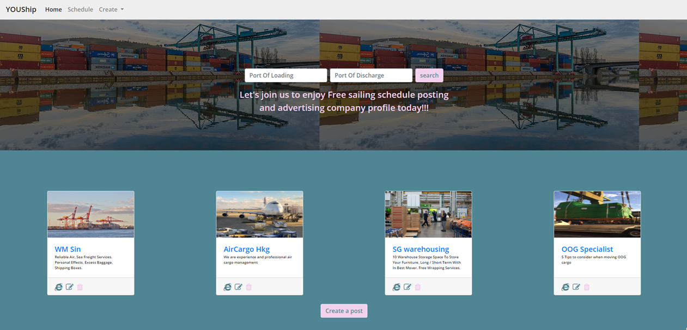

# YOUShip
View the live project <a href="https://shyan-tgc-pro3.herokuapp.com/" target="_blank">here</a>.

This is an online shipping advertisement platform

Purpose:
* In this project, I build a full-stack site that allows users to manage a common dataset about a particular domain.

Value provided:
* Users make use of the site to share their own data with the community, and benefit from having convenient access to the data provided by all other members.
* The site owner advances their own goals by providing this functionality, potentially by being a regular user themselves. The site owner also benefit from the collection of the dataset as a whole, make profit on the advertisement, posting inhouse sailing schedule & advertising inhouse branding as well.




# User Experience - User Interface (UX-UI)

## 1) STRATEGY
* External user’s goal: Find, share vessel schedule and advertise their company profile

* Site owner's goal: Promote a brand of shipping advertisement platform

* Target audience :
```
    ● Business to business
    ● Shipper & Freight Forwarder
```

* Therefore, the platform should focus on:
```
    ● Design a front end for a full stack application following the principles of UX design which meets accessibility guidelines, is easy to navigate and allows the user to find information and resources intuitively
    ● Design a full stack application that lets the user initiate and control actions and gives immediate and full feedback on data processes
    ● Implement a full stack application whose purpose is immediately evident to a new user and which provides a good solution to the user’s demands and expectations
    ● All Create, Read, Update and Delete actions are immediately reflected in the user interface
```

## 2) SCOPE
### Identifying External Users:
* The primary purpose of this platform is to allow external users to share their own schedule data and advertise their branding with the community, and benefit from having convenient access to the data provided by all other members. The person may be the site owner, business owners or employees in shipping/freight forwarding industry (hereafter known as "Shipping company"),  or person in trading or manufacturer industry (hereafter known as "Shippers").

### Identifying Site Owner:
* The site owner advances their own goals by providing this functionality, potentially by being a regular external user themselves. The site owner also benefit from the collection of the dataset as a whole and advertisement sign up fee. 

### 2a) User Stories 
```
    ● US1. As an external user, I want to get the information easily within few clicks, so that I can finish my task as much as possible. 
    ● US2. As an external user, I want to visit a responsive website, so that I can complete my job at anytime anywhere easily without rely on computers.
    ● US3. As an external user, I want to visit a good user interactive website, so that i feel it is a trustworthy website to working with.
    ● US4. As an external user, I want to get the information easily within a particular domain, so that it save my memory & time. 
    ● US5. As an external user, I want to have more choices on sailing schedule & vendor (shipper companies), so that I can meet the production & client' requirements easily.
    ● US6. As an external user, I want to know more about the company who posted the schedule, so that I can make decision whether to contact the vendor.
    ● US7. As an external user (Shipping company), I want to create, display, edit and delete my in-house sailing schedule within the particular domain, so that I can benefit from this website as well. 
    ● US8. As an external user (Shipping company), I want to advertise my company profile on the platform, so that it help to develop a distinctive brand for my business and stand out from our competitors
    ● US9. As an Site Onwer, I want to collect data information through this platform, so that I can develop it to other businesses in future. 
    ● US10. As an Site Onwer, I want to have an advertisement sign up session, so that I can gain some returns on this platform. (Optional after its popular)
```

### 2b) Functional Requirement (FR)					
| User Stories | FR |	Functional Requirement (FR)  |			
|     :---:    |     :---: |:---       |					
| US1 |	FR1 |	FixedTop Navigation that all resources are easy to find, allowing shippers to navigate the layout of the site intuitively.   |	
| US2 |	FR2 |	Responsive design  |	
| US5 |	FR3 |	Searchable sailing schedule   |	
| US6 |	FR4 |	Allow external users to the view Shipping companies' website site & profile  |	
| US7 |	FR5 |	Allow external users (Shipping companies) to add, update and delete their own sailing schedule   |	
| US8 |	FR6 |	Allow external users (Shipping companies) to add, update and delete image or article for advertisement   |	
| US9 |	FR7 |	A library for Site Onwer to collect data information through this platform "Backend"  |	
| US10 |	FR8 |	Allow external users (Shipping companies) to sign up for the advestisement session (Optional)  |	
						
						
### 2c) Content Requirement (CR)			
| User Stories | CR |	Content Requirement (CR)  |			
|     :---:    |     :---: |:---       |			
| US3 |	CR1 |	User interactions design  |	
| US4 |	CR2 |	A short & quick introduction to attract more external users posting sailing & advertise their profile at this Platform  |	
| US5 |	CR3 |	Sailing schedule section  |	
| US5 |	CR4 |	Advertising members' profile section  |	
| US7 |	CR5 |	CRUD sailing schedule section  |	
| US8 |	CR6 |	CRUD image and article section for profile advertisement  |	
| US10 |	CR7 |	(Optional) Sign up section for advertisement  |	


## 3) STRUCTURE				
### 3a) Information Architecture				
#### Image required				
Image required on the website to fulfill the content requirements.				
| US |	CR |	CI |	Content Inventory (CI)  |	
|     :---:    |     :---: |     :---:    |:---       |	
| US3 |	CR1 |	CI1 |	Hero background image   |	
				
#### Content Inventory (CI)				
Information required on the website to fulfill the content requirements.				
				
| US |	CR |	CI |	Content Inventory (CI)  |	
|     :---:    |     :---: |     :---:    |:---       |	
| US4 |	CR2 |	CI2 |	A nice & short sentences to promote this platform  |	
| US5 |	CR3 |	CI3 |	"R" View Sailing schedule session  |	
| US5 |	CR4 |	CI4 |	"R" View Profile advertisement session  |	
| US7 |	CR5 |	CI5 |	"C" + "U" sailing schedule section  |	
| " |	" |	CI6 |	"D" sailing schedule section  |	
| US8 |	CR6 |	CI7 |	"C" + "U" image and article section for profile advertisement session  |	
| " |	" |	CI8 |	"D" image and article section for profile advertisement session  |	

#### Content Structure (CS)
In these modern days, users are constantly bombarded with too much content, people love simplicity. With this, we design it as a "One-page websites" offer a fast and clear reading experience. The contents will be regroup into a sequential structure as below IA Sitemap for landing Page & overall. 


##### Landing Page :
```
CI1.	It starts with a landing page with a 100% width image allow visitor perceive briefly of what is the related industry 		
CI2.	A nice & short sentences allow visitor to more understand the platform a little better.		
```			
##### Profile advertisement session :  			
```			
CI4.	"R" View Profile advertisement session		
CI7.	"C" + "U" image and article  button		
CI8.	"D" image and article button		
```			
##### Sailing session :  			
```			
CI3.	"R" View Sailing schedule session		
CI5.	"C" + "U" sailing schedule button		
CI6.	"D" sailing schedule button		
```
##### IA Sitemap (Overall)


				


## Deployment 

### b) PRODUCTION

#### Launch a workspace container at Gitpod

#### 1. Create file --> requirements.txt  

```
click==7.1.2
dnspython==1.16.0
Flask==1.1.2
itsdangerous==1.1.0
pymongo==3.10.1
python-dotenv==0.13.0
Werkzeug==1.0.1
```

The requirements we are installing are:
```
`pip3 install flask`
`pip3 install pymongo` -- to use Mongo DB
`pip3 install dnspython` -- is to allow us to connect to Mongo with just the URL
`pip3 install python-dotenv` -- allows the use of `.env` files for environment variables
```
#### 2. How to use requirements.txt
```
pip3 install -r requirements.txt
```
#### 3. Create `.env` file to store the passwords and security-sensitive information.
#### 4. Create `.gitignore` file to git ignore the environment variables file, which are never committed to the repository.
```
.env
```
#### 5. Create file `app.py` and insert flask template

#### 6. Connect mongodb 
```
MONGO_URI = os.environ.get("MONGO_URI")
client = pymongo.MongoClient(MONGO_URI)
DB_NAME = "pro3"
```

#### 7. Open Browser
To run a backend Python file, type `python3 app.py`, if Python file is named `app.py` of course.
A blue button should appear to click: *Make Public*,
Another blue button should appear to click: *Open Browser*.

#### 8. "C"RUD = Create function & template
To insert a document into the collection use `<database>.<collection>.insert_one()`

#### 9. C"R"UD = Reading function & template
Using <a href="https://getbootstrap.com/docs/4.4/content/tables/">Bootstrap Table</a> to show the schedule list, added Create button at the home page to bring external user to the create form page. Also, use of Flask `redirect` to bring external user back to the home page. 

#### 10. CR"U"D = Update function & template
* Import `from bson.objectid import ObjectId` at `app.py`
* Getting a single document use `<database>.<collection>.find_one()`
* Use `"$set":` for pymongo 


#### 11. CRU"D" = Delete function & template
To delete a document use `<database>.<collection>.remove()`

#### 12. import datetime, Python strptime()
```datetime.datetime.strptime(date, "%Y-%m-%d")```

#### 13. Flash Messages 
* Import Flash `from flask import flash` at `app.py` file
* Generate Session Key from https://randomkeygen.com/
* Save the Session Key in the `.env` file 
* Save & restart server `python3 app.py`
* Read in the SESSION_KEY variable from the operating system environment `SESSION_KEY = os.environ.get('SESSION_KEY')`
* Set the session Key `app.secret_key = SESSION_KEY`
* In the `layout.template.html` add in the code to display the flash messages:
    ```
    
        
            
            <div class="alert alert-success">
                {{m}}
            </div>
            
        
    
    ```

#### 14. Search function
* NOTE : method is GET
* HTML : Use <a href="https://getbootstrap.com/docs/4.0/components/forms/#inline-forms">Bootstrap 4 Inline Forms</a>
* app.py : added coding 
* Use of `"$regex"` Regular Expression forms a search pattern.
* Use of `"$options": "i"` to carry out search without considering upper or lower case.

#### 15. "C"RUD = Upload profile image for advertisement ('ads')
* Sign up <a href="https://cloudinary.com/users/login">Cloudinary</a>
* Save the could name & the upload preset in `.env` file. 
* Retrieve the cloud name and the upload preset from the .env file in the Flask app
    ```
    CLOUD_NAME = os.environ.get("CLOUD_NAME")
    UPLOAD_PRESET = os.environ.get("UPLOAD_PRESET")
    ```
* Run server `python3 app.py` again
* Create `@app.route("/profile/upload")` for view route
* Create `profile_upload.template.html` 
* Pass the cloud name and the upload preset to the Upload Widget script
    ```
    <script src="https://widget.cloudinary.com/v2.0/global/all.js" type="text/javascript"></script> 
    
    <script type="text/javascript">
        var myWidget = cloudinary.createUploadWidget({
            cloudName: '{{cloud_name}}', 
            uploadPreset: '{{upload_preset}}'}, (error, result) => { 
                if (!error && result && result.event === "success") { 
                console.log('Done! Here is the image info: ', result.info); 
                }
            }
        )

        document.getElementById("upload_widget").addEventListener("click", function(){
                myWidget.open();
        }, false);
    </script>
    ```
* Setup a `<form method="POST">` to capture the uploaded image url
    ```
    <div>
        <a id="upload_widget" class="cloudinary-button mt-3">Upload Image</a>
        <input type="hidden" id="uploaded_image_url" name="uploaded_image_url"/>
    </div>
    ```
* Change the JavaScript to put in the image url into the hidden form field
    ```
    let myWidget = cloudinary.createUploadWidget({
        cloudName: '{{cloud_name}}', 
        uploadPreset: '{{upload_preset}}'}, (error, result) => { 
            if (!error && result && result.event === "success") { 
            console.log('Done! Here is the image info: ', result.info); 
            let fileURL = document.querySelector("#uploaded_image_url");
            fileURL.value = result.info.url;
            }
        }
    )
    ```
* Process the form and save its data to Mongo

#### 16. C"R"UD = Reading function for Uploaded profile ads image & description 
* <a href="https://getbootstrap.com/docs/4.1/components/card/"></a>Bootstrap 4 Cards</a>
* Using the grid, wrap cards in columns and rows.

#### 17. CR"U"D = Update function for profile ads 
* Import `from bson.objectid import ObjectId` at `app.py`
* Getting a single document use `<database>.<collection>.find_one()`
* Use `"$set":` for pymongo 
* insert in JavaScript `document.querySelector("#updated_image").src = result.info.url;`

#### 18. CRU"D" = Delete function for profile ads 
To delete a document use `<database>.<collection>.remove()`

#### 19. Static CCS 
* To create & link the style.css file
    * At the folder, create a new folder `static`
    * At the `static` folder, create a new file `style.css`
    * Inside `<head>` of `layout.template.html`, added `<link rel="stylesheet" href="/static/style.css"/>`
    * run `python3 app.py` for testing
* Import <a href="https://fonts.google.com/specimen/Open+Sans?category=Sans+Serif&selection.family=Open+Sans:wght@600&sidebar.open=true">Google Font</a>
* Added <a href="https://getbootstrap.com/docs/4.0/components/navbar/">Bootstrap fixed top navigation bar</a>
* Added a landing image by using <a href="https://www.w3.org/TR/css-images-3/#linear-gradients">linear-gradients</a> to make the image darker
* Manage the "search function" layout, alignment and responsive variations by using <a href="https://getbootstrap.com/docs/4.1/utilities/flex/">.d-lg-flex</a>. 
* Used of <a href="https://getbootstrap.com/docs/4.4/components/jumbotron/">Jumbotron</a> to extend the entire viewport at home page 
* Fixed Ads Profile Card responsive by using <a href="https://getbootstrap.com/docs/4.0/utilities/spacing/">`mx-auto`</a> and <a href="https://getbootstrap.com/docs/4.3/components/card/">Bootscrap Card</a>
* Used of <a href="https://fontawesome.com/v4.7.0/icons/">Font Awesome Icons</a> to represent accessibility standards
* Used of `target="_blank"`to improve the UX, when user click on any link out (to another web site or social site), that opens a new window. 

### C) PUBLICATION
* Sign up for a <a href="https://www.heroku.com">Heroku</a> account
* At Gitpod terminal : 
    * log into Heroku using  `heroku login`
    * create a new app  `heroku create <app_name>` 
    * add new remote `git remote -v`
    * to can run Python web applications that implement the application interface `pip3 install gunicorn`
* At the folder, create a new file `Procfile`
* Save `web gunicorn <your python file name without .py>:app` inside the `Procfile`file
* At Gitpod terminal : 
    * create requirements file `pip3 freeze --local > requirements.txt`
    * `git add .`
    * commit everything `git commit -m "<Commit Message>"`
    * push to heroku using `git push heroku master`
* Go the <a href="https://www.heroku.com">Heroku</a> Site :
    * click on your project 
    * ciick on Setting
    * click on Reveal Config Vars
    * save all your environment variables (in .env file) into Reveal Config Vars 
    * at the top left, cilck on "Open App" 
* Done publication!!

#### To update the Heroku deployed site 
* At Gitpod terminal : 
    * log into Heroku using  `heroku login`
    * to remote `git remote -v`
    * `git add .`
    * commit everything `git commit -m "<Commit Message>"`
    * push to heroku using `git push heroku master`

