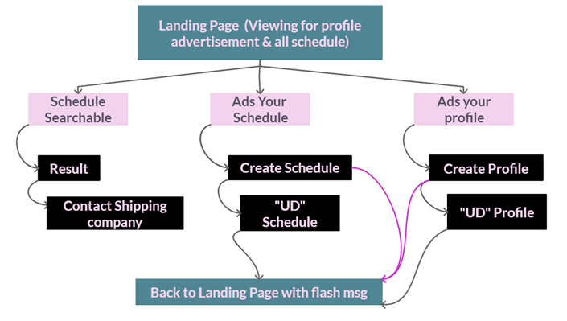
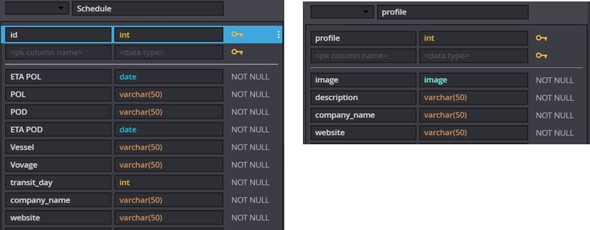

# YOUShip
View the live project <a href="https://shyan-tgc-pro3.herokuapp.com/" target="_blank">here</a>.

This is an online shipping advertisement platform

Purpose:
* In this project, I build a full-stack site that allows users to manage a common dataset about a particular domain.

Value provided:
* Users make use of the site to share their own data with the community, and benefit from having convenient access to the data provided by all other members.
* The site owner advances their own goals by providing this functionality, potentially by being a regular user themselves. The site owner also benefit from the collection of the dataset as a whole, make profit on the advertisement, posting inhouse sailing schedule & advertising inhouse branding as well.


# User Experience - User Interface (UX-UI)

## 1) STRATEGY
* External user’s goal: Find, share vessel schedule and advertise their company profile

* Site owner's goal: Promote a brand of shipping advertisement platform

* Target audience :
```
    ● Business to business
    ● Shipper & Freight Forwarder
```

* Therefore, the platform should focus on:
```
    ● Design a front end for a full stack application following the principles of UX design which meets accessibility guidelines, is easy to navigate and allows the user to find information and resources intuitively
    ● Design a full stack application that lets the user initiate and control actions and gives immediate and full feedback on data processes
    ● Implement a full stack application whose purpose is immediately evident to a new user and which provides a good solution to the user’s demands and expectations
    ● All Create, Read, Update and Delete actions are immediately reflected in the user interface
```

## 2) SCOPE
### Identifying External Users:
* The primary purpose of this platform is to allow external users to share their own schedule data and advertise their branding with the community, and benefit from having convenient access to the data provided by all other members. The person may be the site owner, business owners or employees in shipping/freight forwarding industry (hereafter known as "Shipping company"),  or person in trading or manufacturer industry (hereafter known as "Shippers").

### Identifying Site Owner:
* The site owner advances their own goals by providing this functionality, potentially by being a regular external user themselves. The site owner also benefit from the collection of the dataset as a whole and advertisement sign up fee. 

### 2a) User Stories 
```
    ● US1. As an external user, I want to get the information easily within few clicks, so that I can finish my task as much as possible. 
    ● US2. As an external user, I want to visit a responsive website, so that I can complete my job at anytime anywhere easily without rely on computers.
    ● US3. As an external user, I want to visit a good user interactive website, so that i feel it is a trustworthy website to working with.
    ● US4. As an external user, I want to get the information easily within a particular domain, so that it save my memory & time. 
    ● US5. As an external user, I want to have more choices on sailing schedule & vendor (shipper companies), so that I can meet the production & client' requirements easily.
    ● US6. As an external user, I want to know more about the company who posted the schedule, so that I can make decision whether to contact the vendor.
    ● US7. As an external user (Shipping company), I want to create, display, edit and delete my in-house sailing schedule within the particular domain, so that I can benefit from this website as well. 
    ● US8. As an external user (Shipping company), I want to advertise my company profile on the platform, so that it help to develop a distinctive brand for my business and stand out from our competitors
    ● US9. As an Site Onwer, I want to collect data information through this platform, so that I can develop it to other businesses in future. 
    ● US10. As an Site Onwer, I want to have an advertisement sign up section, so that I can gain some returns on this platform. (Optional after its popular)
```

### 2b) Functional Requirement (FR)					
| User Stories | FR |	Functional Requirement (FR)  |			
|     :---:    |     :---: |:---       |					
| US1 |	FR1 |	FixedTop Navigation that all resources are easy to find, allowing shippers to navigate the layout of the site intuitively.   |	
| US2 |	FR2 |	Responsive design  |	
| US5 |	FR3 |	Searchable sailing schedule   |	
| US6 |	FR4 |	Allow external users to the view Shipping companies' website site & profile  |	
| US7 |	FR5 |	Allow external users (Shipping companies) to add, update and delete their own sailing schedule   |	
| US8 |	FR6 |	Allow external users (Shipping companies) to add, update and delete image or article for advertisement   |	
| US9 |	FR7 |	A library for Site Onwer to collect data information through this platform "Backend"  |	
| US10 |	FR8 |	Allow external users (Shipping companies) to sign up for the advestisement section (Optional)  |	
						
						
### 2c) Content Requirement (CR)			
| User Stories | CR |	Content Requirement (CR)  |			
|     :---:    |     :---: |:---       |			
| US3 |	CR1 |	User interactions design  |	
| US4 |	CR2 |	A short & quick introduction to attract more external users posting sailing & advertise their profile at this Platform  |	
| US5 |	CR3 |	Sailing schedule section  |	
| US5 |	CR4 |	Advertising members' profile section  |	
| US7 |	CR5 |	CRUD sailing schedule section  |	
| US8 |	CR6 |	CRUD image and article section for profile advertisement  |	
| US10 |	CR7 |	(Optional) Sign up section for advertisement  |	


## 3) STRUCTURE				
### 3a) Information Architecture				
#### Image required				
Image required on the website to fulfill the content requirements.				
| US |	CR |	CI |	Content Inventory (CI)  |	
|     :---:    |     :---: |     :---:    |:---       |	
| US3 |	CR1 |	CI1 |	Hero background image   |	
				
#### Content Inventory (CI)				
Information required on the website to fulfill the content requirements.				
				
| US |	CR |	CI |	Content Inventory (CI)  |	
|     :---:    |     :---: |     :---:    |:---       |	
| US4 |	CR2 |	CI2 |	A nice & short sentences to promote this platform  |	
| US5 |	CR3 |	CI3 |	"R" View Sailing schedule section |	
| US5 |	CR4 |	CI4 |	"R" View Profile advertisement section  |	
| US7 |	CR5 |	CI5 |	"C" + "U" sailing schedule section  |	
| " |	" |	CI6 |	"D" sailing schedule section  |	
| US8 |	CR6 |	CI7 |	"C" + "U" image and article section for profile advertisement section  |	
| " |	" |	CI8 |	"D" image and article section for profile advertisement section  |	

#### Content Structure (CS)
In these modern days, users are constantly bombarded with too much content, people love simplicity. With this, we design it as a "One-page websites" offer a fast and clear reading experience. The contents will be regroup into a sequential structure as below IA Sitemap for landing Page & overall. 


##### Landing Page :
```
CI1.	It starts with a landing page with a 100% width image allow visitor perceive briefly of what is the related industry 		
CI2.	A nice & short sentences allow visitor to more understand the platform a little better.		
```			
##### Profile advertisement section :  			
```			
CI4.	"R" View Profile advertisement section	
CI7.	"C" + "U" image and article  button		
CI8.	"D" image and article button		
```			
##### Sailing section :  			
```			
CI3.	"R" View Sailing schedule section	
CI5.	"C" + "U" sailing schedule button		
CI6.	"D" sailing schedule button		
```
#### IA Sitemap (Overall)



#### Database Structure
##### Entity Relationship Diagram (ERD)
This ERD  is relevant on this particular domain, consisting of three collections (User, sailing schedule & profile ads).


#### Data model
##### Logical Diagram
However,I will only implement 2 collections (sailing schedule & profile ads) on this project at this moment due to i've not implemented user auth as at now to fits the purpose of the project




### 3b) Interaction Design      	
#### Learnability	
      i.	Different navigation are positions at the familiar location a web surfer, and throughout the website to enhance familiarity and consistency. (FR1)
            a.	Logo that leads back to the home page
            b.	navigation system in the form of site map allowing visitor to view all the sections at a glance
            c.  a clear and unambiguous navigation structures to <a href="http://www.flaskboilerplate.com/" target="_blank">fixed at the top</a>
            d.	all resources on the site are easy to find, allowing users to navigate the layout of the site intuitively
      ii.	Button with hover effect will be used to indicate there's a link to the working project to increase the predictability.
      iii.	<target="_blank"> was used to improve the UX, when user click on any link out (to another web site or social site), that opens a new window. Whereas when they're clicking on a link internal to a site that they remain within the same browser window
#### Understandability	
      i.	Content are group into logical order with short word or phrase title easily understandable 
      ii.	Readability (Flesch Kincaid Reading Ease Test = 73.3, Flesch-Kincaid Grade Level Score = 5.2)       

#### Operability	
      i.	The visitors able to easily search the sailing schedule without encountering any issues. (FR3)
      ii.	Allow visitors to the view Shipping companies' website site & profile (FR4)
      iii.	Allow external users (Shipping companies) to add, update and delete their own sailing schedule (FR5)
      iv.	Allow external users (Shipping companies) to add, update and delete image or article for advertisement (FR6)
#### Attractiveness	
      i.	Responsive design to take into consideration how it looks when on viewed on a desktop browsers as well as smaller screens like mobile phone. The layout will change to cater for different size of the device. (FR2)
      ii.	Utilization of negative space between different sections and components of the page to increase readability
#### Usability compliance	
      i.	Semantic HTML to enhance code readability 
      ii.	Rearrangement of the component 
      iii.	Used of <a href="https://flask.palletsprojects.com/en/1.1.x/patterns/flashing/" target="_blank">Message Flashing</a> to give user feedback all the times. E.g :" the form has been created, updated or deleted."
#### Accessibility	
      i.	there is clear conformity to accessibility guidelines across all pages/sections and in all interactivity
      ii.	The <a href="https://v4-alpha.getbootstrap.com/getting-started/accessibility/">aria-label attribute</a> is used to define a string that labels the current element, in cases where a text label is not visible on the screen. 

## 4) SKELETON
### 4a) Interface design


1. Each page will include two parts - header and main content to keep the consistency
2. Header include sections that will be repeated all the pages to improve predictability and consistency.
3. Fixed-top Header will include a logo and the main navigation 
4. The main content section will display content related to the page.


#### Sitemap (Landing Page)


#### Sitemap (C+U+D Page)

			
### 4b) Navigation design 
If External User get lost, the navigation bar will point them in the right direction. Bootstrap component will be used to make the fixed-top navigation responsive.
```
Logo
● Logo on every page, clicking on it will bring the visitor to the Home Page. [Bootstrap Component - Navbar] 

Main Navigation
● Main Navigation is a fixed position menu at the top of every web page. It designed for External User's convenience from one page to another easily. They are hyperlinked to their respective pages. There is hover function too, so users know its clickable when mouse over. [Bootstrap Component - Navbar] 

Collapsible Hamburger Mobile Menu
● The top navigation will be minimized into a hamburger menu when displayed in mobile screens or other small screens. Clicking on it will display the familiar 3 choices. [Bootstrap Component - Navbar] 

Button for "Search", "Create" & "View all" 
● Can easily get it from the navigation bar, which will point external users to the right direction. 

Button for "Update" & "Delete"
● Update & delete icon will be showed on every id object
```
#### Button for "Update" & "Delete"
 

#### 4c) Information Design
##### Platform Branding
A brand is the set of expectations, memories, stories and relationships that, taken together, account for a consumer's decision to choose one product or service over another. Here are the key design elements we use to create a brand identity that is strong, consistent, and attractive. 

      (CI1) High resolution Hero photo to be displayed 100% width at the home page, which can build an emotional connection with the External User.
      (CI2) Clear brand purpose and positioning
      (CI2) Memorable brand "YOUShip" also is created to make an impression.
      (FR1) Good navigation is key to attracting the External User, show them we care about their feeling, even just a single movement on the webpage. We do not want them to get lost. 
      (FR2) A Modern Responsive Web Design will tell External User that the platform is ahead of others, a free flexible and free advertisement Shipping platform
            (CS) One-page websites
            (FR2) Responsive design
            (FR3) Searchable function
            (FR4~FR6) CRUD for any members at zero cost
      (5. Surface Color) Attractive color palette 
      (5. Surface Font) Professional typography 
      (5. Surface Image) A modern & energetic aesthetic image 

## 5) SURFACE
 

### Colour
The color palette keep at simple, with only 1–3 primary colors. In this website, the site logo is dark purple, so I will choose Green and light purple to neutral it. 

### Typography
Font-Family <a href="https://fonts.google.com/specimen/Open+Sans?category=Sans+Serif&selection.family=Open+Sans:wght@600&sidebar.open=true" target="_blank">“Sans serif”</a> are chosen as the most famous fonts are recognizable even when taken out of context. A single primary typeface to lead the brand identity design, and it also work well with the branding and color palette. And giving the image of being modern, approachable, and clean. 
CSS rules to specify families font-family: 'Open Sans', sans-serif;
Open Sans Semi-bold 600 `<link href="https://fonts.googleapis.com/css2?family=Open+Sans:wght@600&display=swap" rel="stylesheet">`

### Imagery
Full-width cover “containers port” image selected aims to build an emotional connection with External User, tell them what this platform is doing, related to which industry as well as Illustrations strengthen the branding.

# FEATURES
### Ease of navigation (FR1)
      Feature 1. Allow the External User to view all the sections at a glance and from one page to another easily by having the fixed-top position navigation system (FR1)
      Feature 2. Allow the External User to search schedule straightaway, by having “Search” function at the Center of the Landing page and hyperlink it to “result” page directly. (FR3 & CR1) 

### Responsiveness (FR2)
      Feature 3. Allow the External User to view the platform with all devices, like desktop, laptop, tablets and smart mobile phones. It can be view in both portrait and landscape orientation as well by implement the responsive design. (FR2) 

### User interactions design (CR1)
      Feature 4. Hover effect "enlarge & change of button color" on all the clickable button/hyperlinks to provide results in a manner that is visually appealing and user friendly
      Feature 5. Graphical elements like images, typography and icons are used to replace the words to communicate information to users 
      Feature 6. Used of <a href="https://flask.palletsprojects.com/en/1.1.x/patterns/flashing/" target="_blank">Message Flashing</a> to give user feedback all the times. E.g :" the form has been created, updated or deleted."
    
### Consistency and predictability (CR1)
      Feature 7. Allow the External User to stay clear and easy find the same components position at the same place regardless of which page they are at by having the header and theme stay consistent throughout the site. 

### Profile Ads section (CR4)
      Feature 8. Allow the External User to know the current popular and active Shipping Companies in this plarform. 
      Feature 9. Allow the External User to know more about the Shipping Company, by clicking the "internet icon" on each particular profile ads. (FR4)
      Feature 10. Create the back-end code and front-end form(s), which allow external users (Shipping companies) to create, locate, display, edit and delete profile ads records. (FR6)

### Schedule section (CR3 & CR5)
      Feature 11. Allow the External User to view all sailing schedules information at the "view all schedule" section (CR3)
      Feature 12. To simplify External Users’ supply chain, I create the back-end and front-end functionality for external users to locate schedule based on the sailing schedule fields by using a full search functionality (FR3) 
      Feature 13. Allow the External User to know more that particular Shipping company by clicking the "member name" on each particular schedule. (FR4)
      Feature 14. Create the back-end code and front-end form(s), which allow external users (Shipping companies) to create, locate, display, edit and delete schedule records. (FR6)
      
### Backend Data Collection (FR7)
      Feature 15. Used of MongoDB to collect data information through this platform "Backend" (FR7) 

### Security Features
      Feature 16. The <.gitignore> file was created for the purpose of preventing files, environment variables, any passwords or security sensitive information, from being uploaded without needing to explicitly exclude them. Any file added to the gitignore will never be included in git commits. Not only does this feature allow for system-specific files to be untouched, but it allows for insurance that sensitive files will never be uploaded. 

## Features Left to Implement
      Feature 17. Allow external users (Shipping companies) to sign up for the advestisement section (Optional) (FR8)
      Feature 18. Can have the Carousel effect on the profile card ads to keep the advertising at one row and more attractive

# TECHNOLOGIES USED  
## requirements.txt
```
click==7.1.2
dnspython==1.16.0
Flask==1.1.2
itsdangerous==1.1.0
pymongo==3.10.1
python-dotenv==0.13.0
Werkzeug==1.0.1
cloudinary==1.20.0
gunicorn==20.0.4
```
## Technologies, Frameworks, Libraries & Programs Used 
### Preparation
1) <a href="https://fonts.google.com/specimen/Open+Sans?category=Sans+Serif&selection.family=Open+Sans:wght@600&sidebar.open=true" target="_blank">Google Font</a> to making the web more beautiful, fast, and open through great typography 
2) <a href="https://www.sessions.edu/color-calculator/" target="_blank">Sessions College color calculator</a> to find the perfect color scheme 
3) <a href="https://unsplash.com" target="_blank">Unsplash</a> to get an high resolution image
4) <a href="https://pencil.evolus.vn/" target="_blank">Pencil Project </a>was used to create the wireframes during the design process.
5) <a href="https://erdplus.com/" target="_blank">ERDPlus </a> to design the database structure, Entity Relationship Diagram (ERD)
6) <a href="https://sqldbm.com/Home/" target="_blank">SQLDbm</a> to design the data model, Logical Diagram

### Production (Coding)
7) Git was used for version control by utilizing the Gitpod terminal to commit to Git and Push to GitHub.
8) <a href="https://github.com/" target="_blank">Github</a> for Versioning Control System and GitHub for repositories to store the projects code after being pushed from Git.
9) <a href="https://www.gitpod.io/" target="_blank">Gitpod</a> for code editor redefined and optimized for building and debugging modern web 
10) <a href="https://www.w3schools.com/html/html_intro.asp" target="_blank">HTM5</a> to structure the webpages
11) `.gitignore` file is used for the purpose of preventing files, environment variables, any passwords or security sensitive information, from being uploaded without needing to explicitly exclude them. Any file added to the gitignore will never be included in git commits. Not only does this feature allow for system-specific files to be untouched, but it allows for insurance that sensitive files will never be uploaded. 
12) `pip3 install pymongo` to use Mongo DB
13) `pip3 install dnspython` -- allow us connect to Mongo with just the URL
14) `pip3 install python-dotenv` -- allows the use of `.env` files for environment variables
15) <a href="https://flask.palletsprojects.com/en/1.1.x/tutorial/" target="_blank">Python+Flask</a> web framework to build a web application
16) <a href="https://www.mongodb.com/" target="_blank">MongoDB</a> to store document described in JSON, a formatting language. Document databases are extremely flexible, allowing variations in the structure of documents and allowing storage of documents that are partially complete.
17) <a href="https://www.w3schools.com/js/" target="_blank">JavaScript</a> to CRUD Cloudinary profile as image 
18) <a href="https://flask.palletsprojects.com/en/1.1.x/patterns/flashing/" target="_blank">Message Flashing</a> to give user feedback all the times. E.g :" the form has been created, updated or deleted."

### Production (Styling)	
19) <a href="https://getbootstrap.com/docs/4.4/getting-started/introduction/" target="_blank">Bootstrap 4.4.1</a> was used to assist with the responsiveness and styling of the website.	
20) <a href="https://www.w3schools.com/css/css_intro.asp" target="_blank">CSS3</a> to style HTML contents	
21) <a href="https://getbootstrap.com/docs/4.4/components/navbar/" target="_blank">BootStrap </a>to fix top & responsive navigation bar
22) <a href="https://www.w3.org/TR/css-images-3/#linear-gradients" target="_blank">linear-gradients </a>to make the landing page Hero image darker
23) <a href="https://getbootstrap.com/docs/4.1/utilities/flex/" target="_blank">d-lg-flex </a>to fix the search function layout, alignment and responsive variations
24) Hover.css was used on all clickable icons while being hovered over.	
25) <a href="https://getbootstrap.com/docs/4.4/components/jumbotron/" target="_blank">Jumbotron </a>to extend the entire viewport at profile advertisement section
26) <a href="https://getbootstrap.com/docs/4.0/utilities/spacing/" target="_blank">`mx-auto`</a> and <a href=https://getbootstrap.com/docs/4.3/components/card/ target="_blank">Bootscrap Card</a> to fix Ads Profile Card responsive	
27) <a href="https://bootstrap-table.com/docs/getting-started/introduction/" target="_blank">bootstrap-Table</a> for An extended table to the integration with some of the most widely used CSS frameworks. 	
28) `target="_blank"`to improve the UX, when user click on any link out (to another web site or social site), that opens a new window. 	
29) <a href="https://fontawesome.com/v4.7.0/icons/" target="_blank">Font Awesome Icons </a>are used on all pages throughout the website to add icons for aesthetic and UX purposes to represent accessibility standards

### Publication 	
30) <a href="https://gunicorn.org/" target="_blank">Gunicorn</a> to run Python application concurrently by running multiple Python processes within a single dyno	
31) <a href="https://heroku.com/" target="_blank">Heroku</a> to deploy, manage, and scale modern apps, to getting our apps to market.	
	
### Documentary	
32) <a href="https://github.com/Code-Institute-Solutions/readme-template/blob/master/README.md" target="_blank">Code Institute Readme.md template</a> for Readme file report guideline 	

# TESTING
## Tested with no error
| Testing on   | Result |
|:--|:--|
| <a href="https://www.seoptimer.com/alt-tag-checker" target="_blank">Image</a> | "You do not have any images missing ALT attributes on your page"|
| <a href="https://color.a11y.com/Contrast/"  target="_blank">Color</a> | "Congratulations! No automated color contrast issues found on the webpage tested"|
| <a href="https://www.webfx.com/tools/read-able/" target="_blank">Readability</a> | "Flesch Kincaid Reading Ease Test = 73.3, Flesch-Kincaid Grade Level Score = 5.2"|
| Python PEP& Style | No underline error message on gitpod | 
| Different browers | The website was tested on Google Chrome, Microsoft Edge and Safari browsers. | 
| US1 Navigation | Clicked on each of the navigation on every page and all pages were linking correctly. |
| US2 Responsiveness | The site can be viewed and used on a variety of devices such as Desktop, Laptop, iPhone7, iPhone 8 & iPhoneX and resolutions size from (1920x1200) till (320x480)|
| US5 Search function | Return with the right answer, no error found |
| US6 Hyperlink | Managed to direct user to members' promote hyperlink in new tab |
| US7 CRUD data | Users able to add, update and delete their own sailing schedule. There are present and working |
| US8 CRUD Image | Users able to add, update and delete their advertisement image on profile ads. There are present and working |

## Tested with errors result
```
1. Check HTML by using http://validator.w3.org/
    Error found : "Element div not allowed as child of element mark in this context. (Suppressing further errors from this subtree.)"
    Corrective action : change div to mark
    Result : Document checking completed. No errors or warnings to show.

2. Check HTML by using http://validator.w3.org/
    Error found : "The aria-labelledby attribute must point to an element in the same document."
    Corrective action : assign id="navbarDropdownSchedule" to aria-labelledby="navbarDropdownSchedule". Learn from https://developer.mozilla.org/en-US/docs/Web/Accessibility/ARIA/ARIA_Techniques/Using_the_aria-labelledby_attribute
    Result : Document checking completed. No errors or warnings to show.

5. US3 User interactions design
    Error found : table body very messy while hover due to size enlarge
    Corrective action : remove table tbody tr:hover from style.css
    Result : Look much better now!!

6. CR3 "R" on Schedule date format
    Error found : view schedule show date & time, which we only want to show date in YYYY-MM-DD only
    Corrective action : added `.strftime('%Y-%m-%d')` to the function at the home.template.html
    Result : fixed bug!!

7. FR5 "U" on Schedule date
    Error found : date does not show up on the schedule_update.template.html
    Corrective action : added `.strftime('%Y-%m-%d')` to the function at the schedule_update.template.html
    Result : fixed bug!!

8. US3 User interactions on browers
    Error found : Bootstrap card does not display properly on Internet Explorer
    Corrective action : style .card-deck to display: block; learn from https://github.com/twbs/bootstrap/issues/21885
    Result : fixed bug!!

```

# DEPLOYMENT
## a) PREPARATION	
### 1. Design	
* 	Design a good UI UX
* 	Design a database structure, Entity Relationship Diagram that is relevant for that particular domain, consisting of two collection by using <a href="https://erdplus.com/" target="_blank">ERDPlus </a>
*	Design an assess functionality, usability and data management within the Full Stack web application by keep reference back to the user stories, functional & content requirement.
*	Design a data model, a logical diagram that fits the purpose of the project by using <a href="https://sqldbm.com/Home/" target="_blank">SQLDbm</a> 
	
### 2. Content	
* 	Choose font to be used 
* 	Fix color palette to be used 
* 	Find good images to be used 
* 	ensured file & name files consistently and descriptively, without spaces or capitalization to allow for cross-platform compatibility.

### 3. Before coding 	
*	Fixed features 
* 	Understand the PEP8 style guide to ensure the use Python code that is consistent in style and conforms to the PEP8 style guide and validated HTML and CSS code.
*	Fixed Technologies to be used 

## b) PRODUCTION

### 1. Setting up Github Pages
    i. Sign up <a href="https://github.com/" target="_blank">Github</a>
    ii. Log in to GitHub
    iii. Create a new GitHub Repository

### 2. Launch a workspace container at Gitpod
    i. Click to install <a href="https://www.gitpod.io/docs/browser-extension/" target="_blank">Gitpod Browser Extension </a>on browser in you are using Chrome or Firefox for convenient
    ii. Use `Ctrl+F5` on your Github Repository Page to refresh the browser
    iii. You will see a Gitpod button (Green color) is added to GitHub that does the prefixing for your convenience. And click on that button 
    iv. A workspace is creating as easy as prefixing any GitHub URL with gitpod.io/#.

### Take note to commit often for each individual feature/fix, ensuring that commits are small, well-defined and have clear descriptive messages

### 3. Create file --> requirements.txt  

```
click==7.1.2
dnspython==1.16.0
Flask==1.1.2
itsdangerous==1.1.0
pymongo==3.10.1
python-dotenv==0.13.0
Werkzeug==1.0.1
```

The requirements we are installing are:
```
`pip3 install flask`
`pip3 install pymongo` -- to use Mongo DB
`pip3 install dnspython` -- is to allow us to connect to Mongo with just the URL
`pip3 install python-dotenv` -- allows the use of `.env` files for environment variables
```
### 4. How to use requirements.txt
```
pip3 install -r requirements.txt
```
### 5. Create `.env` file to store the passwords and security-sensitive information.
### 6. Create `.gitignore` file to git ignore the environment variables file, which are never committed to the repository.
```
.env
```
### 7. take note to keep debug on any error messages prompt in Gitpod to ensure the use Python code that is consistent in style and conforms to the PEP8 style guide and validated HTML and CSS code.

### 8. Create file `app.py` and insert flask template (Ensure that DEBUG mode is turned off in production versions)

### 9. Connect mongodb 
```
MONGO_URI = os.environ.get("MONGO_URI")
client = pymongo.MongoClient(MONGO_URI)
DB_NAME = "pro3"
```
### 10. take note to keep testing all functionality and usability while coding by opening browser

### 11. Open Browser
To run a backend Python file, type `python3 app.py`, if Python file is named `app.py` of course.
A blue button should appear to click: *Make Public*,
Another blue button should appear to click: *Open Browser*.

### 12. "C"RUD = Create function & template
To insert a document into the collection use `<database>.<collection>.insert_one()`

### 13. C"R"UD = Reading function & template
Using <a href="https://getbootstrap.com/docs/4.4/content/tables/">Bootstrap Table</a> to show the schedule list, added Create button at the home page to bring external user to the create form page. Also, use of Flask `redirect` to bring external user back to the home page. 

### 14. CR"U"D = Update function & template
* Import `from bson.objectid import ObjectId` at `app.py`
* Getting a single document use `<database>.<collection>.find_one()`
* Use `"$set":` for pymongo 


### 15. CRU"D" = Delete function & template
To delete a document use `<database>.<collection>.remove()`

### 16. import datetime, Python strptime()
```datetime.datetime.strptime(date, "%Y-%m-%d")```

### 17. Flash Messages 
* Import Flash `from flask import flash` at `app.py` file
* Generate Session Key from https://randomkeygen.com/
* Save the Session Key in the `.env` file 
* Save & restart server `python3 app.py`
* Read in the SESSION_KEY variable from the operating system environment `SESSION_KEY = os.environ.get('SESSION_KEY')`
* Set the session Key `app.secret_key = SESSION_KEY`
* In the `layout.template.html` add in the code to display the flash messages:
    ```
    
        
            
            <div class="alert alert-success">
                {{m}}
            </div>
            
        
    
    ```

### 18. Search function
* NOTE : method is GET
* HTML : Use <a href="https://getbootstrap.com/docs/4.0/components/forms/#inline-forms">Bootstrap 4 Inline Forms</a>
* app.py : added coding 
* Use of `"$regex"` Regular Expression forms a search pattern.
* Use of `"$options": "i"` to carry out search without considering upper or lower case.

### 19. "C"RUD = Upload profile image for advertisement ('ads')
* Sign up <a href="https://cloudinary.com/users/login">Cloudinary</a>
* Save the could name & the upload preset in `.env` file. 
* Retrieve the cloud name and the upload preset from the .env file in the Flask app
    ```
    CLOUD_NAME = os.environ.get("CLOUD_NAME")
    UPLOAD_PRESET = os.environ.get("UPLOAD_PRESET")
    ```
* Run server `python3 app.py` again
* Create `@app.route("/profile/upload")` for view route
* Create `profile_upload.template.html` 
* Pass the cloud name and the upload preset to the Upload Widget script
    ```
    <script src="https://widget.cloudinary.com/v2.0/global/all.js" type="text/javascript"></script> 
    
    <script type="text/javascript">
        var myWidget = cloudinary.createUploadWidget({
            cloudName: '{{cloud_name}}', 
            uploadPreset: '{{upload_preset}}'}, (error, result) => { 
                if (!error && result && result.event === "success") { 
                console.log('Done! Here is the image info: ', result.info); 
                }
            }
        )

        document.getElementById("upload_widget").addEventListener("click", function(){
                myWidget.open();
        }, false);
    </script>
    ```
* Setup a `<form method="POST">` to capture the uploaded image url
    ```
    <div>
        <a id="upload_widget" class="cloudinary-button mt-3">Upload Image</a>
        <input type="hidden" id="uploaded_image_url" name="uploaded_image_url"/>
    </div>
    ```
* Change the JavaScript to put in the image url into the hidden form field
    ```
    let myWidget = cloudinary.createUploadWidget({
        cloudName: '{{cloud_name}}', 
        uploadPreset: '{{upload_preset}}'}, (error, result) => { 
            if (!error && result && result.event === "success") { 
            console.log('Done! Here is the image info: ', result.info); 
            let fileURL = document.querySelector("#uploaded_image_url");
            fileURL.value = result.info.url;
            }
        }
    )
    ```
* Process the form and save its data to Mongo

### 20. C"R"UD = Reading function for Uploaded profile ads image & description 
* <a href="https://getbootstrap.com/docs/4.1/components/card/"></a>Bootstrap 4 Cards</a>
* Using the grid, wrap cards in columns and rows.

### 21. CR"U"D = Update function for profile ads 
* Import `from bson.objectid import ObjectId` at `app.py`
* Getting a single document use `<database>.<collection>.find_one()`
* Use `"$set":` for pymongo 
* insert in JavaScript `document.querySelector("#updated_image").src = result.info.url;`

### 22. CRU"D" = Delete function for profile ads 
To delete a document use `<database>.<collection>.remove()`

### 23. Static CCS 
* Take note to check the site is responsiveness on every new styling input
* To create & link the style.css file
    * At the folder, create a new folder `static`
    * At the `static` folder, create a new file `style.css`
    * Inside `<head>` of `layout.template.html`, added `<link rel="stylesheet" href="/static/style.css"/>`
    * run `python3 app.py` for testing
* Import <a href="https://fonts.google.com/specimen/Open+Sans?category=Sans+Serif&selection.family=Open+Sans:wght@600&sidebar.open=true">Google Font</a>
* Added <a href="https://getbootstrap.com/docs/4.0/components/navbar/">Bootstrap fixed top navigation bar</a>
* Added a landing image by using <a href="https://www.w3.org/TR/css-images-3/#linear-gradients">linear-gradients</a> to make the image darker
* Manage the "search function" layout, alignment and responsive variations by using <a href="https://getbootstrap.com/docs/4.1/utilities/flex/">.d-lg-flex</a>. 
* Used of <a href="https://getbootstrap.com/docs/4.4/components/jumbotron/">Jumbotron</a> to extend the entire viewport at profile advertisement section 
* Fixed Ads Profile Card responsive by using <a href="https://getbootstrap.com/docs/4.0/utilities/spacing/">`mx-auto`</a> and <a href="https://getbootstrap.com/docs/4.3/components/card/">Bootscrap Card</a>
* Used of <a href="https://fontawesome.com/v4.7.0/icons/">Font Awesome Icons</a> to represent accessibility standards
* Used of `target="_blank"`to improve the UX, when user click on any link out (to another web site or social site), that opens a new window. 

## C) PUBLICATION
* Implement manual test procedures to assess functionality, usability, responsiveness and data management within the Full Stack web application before publication
* Sign up for a <a href="https://www.heroku.com">Heroku</a> account
* At Gitpod terminal : 
    * log into Heroku using  `heroku login`
    * create a new app  `heroku create <app_name>` 
    * add new remote `git remote -v`
    * to can run Python web applications that implement the application interface `pip3 install gunicorn`
* At the folder, create a new file `Procfile`
* Save `web gunicorn <your python file name without .py>:app` inside the `Procfile`file
* At Gitpod terminal : 
    * create requirements file `pip3 freeze --local > requirements.txt`
    * `git add .`
    * commit everything `git commit -m "<Commit Message>"`
    * push to heroku using `git push heroku master`
* Go the <a href="https://www.heroku.com">Heroku</a> Site :
    * click on your project 
    * ciick on Setting
    * click on Reveal Config Vars
    * save all your environment variables (in .env file) into Reveal Config Vars 
    * at the top left, cilck on "Open App" 
* Done publication!!
* Test to ensure it matches the development version 
* Ensure that final deployed site has no broken internal links

### To update the Heroku deployed site 
* At Gitpod terminal : 
    * log into Heroku using  `heroku login`
    * `git add .`
    * commit everything `git commit -m "<Commit Message>"`
    * push to heroku using `git push heroku master`

# CREDITS
## Content
1. Refer to <a href="https://github.com/Code-Institute-Solutions/SampleREADME#" target="_blank">Code Institute Readme.md sample</a> for Readme file report guidelines
2. All images are downloaded from <a href="https://unsplash.com" target="_blank">Unsplash</a> 

## Code
1. Fixed font is chosed from <a href="https://fonts.google.com/specimen/Open+Sans?category=Sans+Serif&selection.family=Open+Sans:wght@600&sidebar.open=true" target="_blank">Google Font</a> to making the web more beautiful, fast, and open through great typography 
2. Refer to the notes took down during the lesson to code the CRUD funtionality 
3. Refer to <a href="https://www.w3.org/TR/css-images-3/#linear-gradients" target="_blank">linear-gradients </a> to darker the landing page hero image
4. Refer to <a href="https://getbootstrap.com/docs/4.1/utilities/flex/"  target="_blank">.d-lg-flex</a> to fix the "search function" layout, alignment and responsive variations
5. Refer to <a href=https://getbootstrap.com/docs/4.4/components/jumbotron/ target="_blank">Jumbotron</a> to extend the entire viewport at profile advertisement section
6. Refer to <a href="https://getbootstrap.com/docs/4.0/utilities/spacing/" target="_blank">`mx-auto`</a> and <a href=https://getbootstrap.com/docs/4.3/components/card/ target="_blank">Bootscrap Card</a> to fix Ads Profile Card responsive
7. Refer to <a href="https://bootstrap-table.com/docs/getting-started/introduction/" target="_blank">bootstrap-Table</a> for An extended table to the integration with some of the most widely used CSS frameworks. 
8. Refer to <a href="https://guides.github.com/features/mastering-markdown/" target="_blank">Github Markdown</a> to lightweight and easy-to-use syntax for styling all forms of writing on the GitHub platform.
9. Refer to <a href="https://github.com/twbs/bootstrap/issues/21885" target="_blank">style .card-deck to display: block</a> to fix the Bootstrap card display properly on Internet Explorer
10. Refer to <a href="https://developer.mozilla.org/en-US/docs/Web/Accessibility/ARIA/ARIA_Techniques/Using_the_aria-labelledby_attribute" target="_blank">MDN wed</a> to fix HTML `aria-labelledby` error

# ACKNOWLEDGEMENTS 
I received inspiration for this project from : 

      1) Facebook https://www.facebook.com/ - on project idea
      2) Channel New Asia Mobile apps - on project idea
      3) Mr Paul Chor - Mentor of my course
      4) Mr Muhd Arif Rawi - Consultant of my project 
      5) Mr Donovan Lo - My classmate – on the Readme report  
      6) Ms Jolene Wai  - My classmate – on project code fixing
